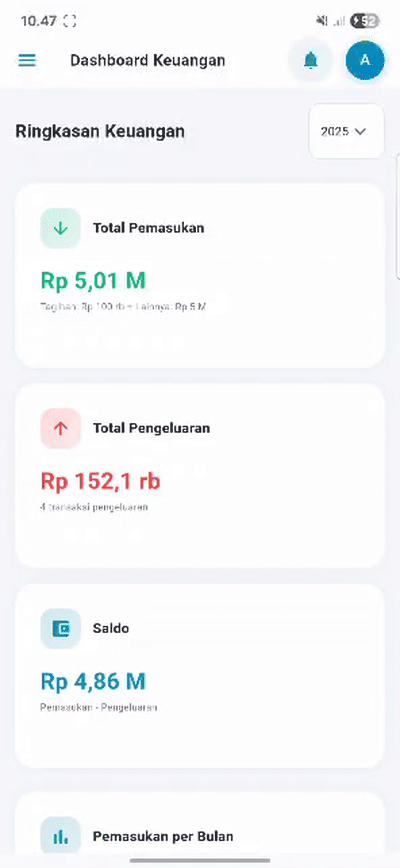
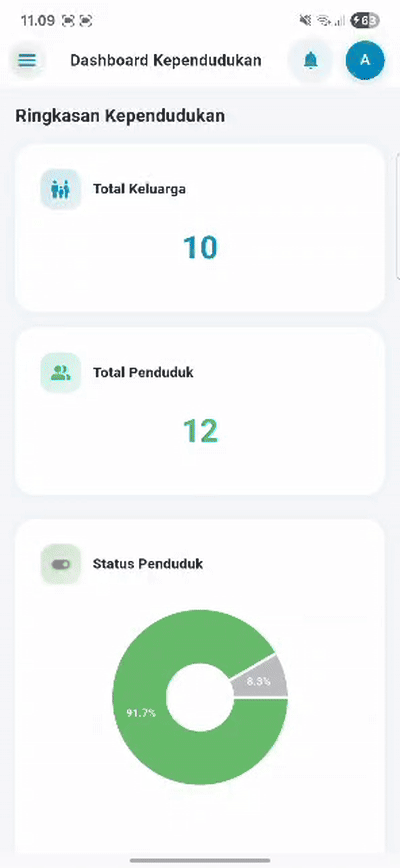
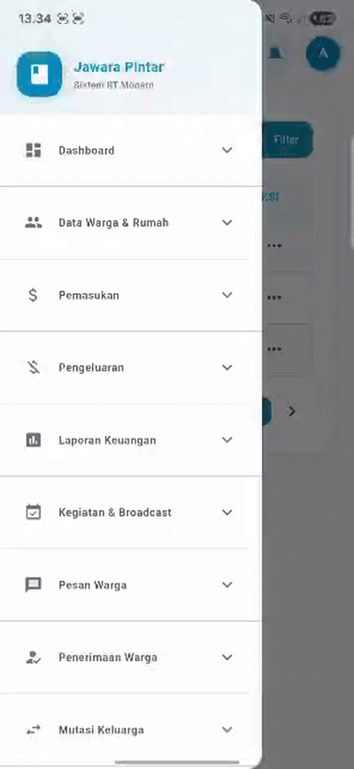
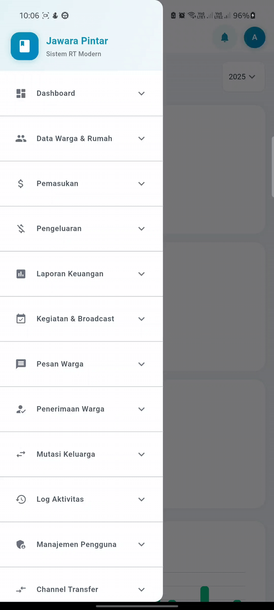

# 📱 PBL Jawara - Sistem Manajemen RT/RW

<div align="center">
  


**Aplikasi manajemen data warga, keuangan, dan kegiatan RT/RW yang modern dan responsif**

[🚀 Demo](#demo) • [✨ Fitur](#fitur) • [📦 Instalasi](#instalasi) • [👥 Kontribusi](#kontribusi) • [📄 Lisensi](#lisensi)

</div>

---

## 📖 Tentang Proyek

**PBL Jawara** adalah sistem informasi manajemen terintegrasi untuk pengelolaan RT/RW yang dirancang dengan teknologi Flutter. Aplikasi ini memudahkan pengurus RT/RW dalam mengelola data warga, keuangan, kegiatan, dan administrasi lainnya dengan interface yang modern dan user-friendly.

### 🎯 Tujuan
- Digitalisasi administrasi RT/RW
- Transparansi pengelolaan keuangan
- Kemudahan akses informasi bagi warga
- Efisiensi dalam pencatatan dan pelaporan

---

## ✨ Fitur Utama

<table>
<tr>
<td width="50%">

### 📊 Dashboard
- **Dashboard Keuangan** - Monitoring pemasukan & pengeluaran
- **Dashboard Kegiatan** - Kalender kegiatan RT/RW
- **Dashboard Kependudukan** - Statistik data warga
- Visualisasi data dengan grafik interaktif (Pie Chart, Bar Chart)

</td>
<td width="50%">

### 👥 Manajemen Warga
- **Data Warga** - CRUD data lengkap warga
- **Data Keluarga** - Pengelolaan data per keluarga
- **Data Rumah** - Informasi rumah dan penghuni
- **Mutasi Keluarga** - Tracking perpindahan warga

</td>
</tr>
<tr>
<td width="50%">

### 💰 Keuangan
- **Pemasukan** - Iuran warga & pemasukan lain
- **Pengeluaran** - Pencatatan pengeluaran RT/RW
- **Kategori Iuran** - Manajemen jenis iuran
- **Laporan Keuangan** - Report lengkap & cetak laporan

</td>
<td width="50%">

### 📢 Komunikasi & Kegiatan
- **Kegiatan RT/RW** - Jadwal dan dokumentasi kegiatan
- **Broadcast** - Pengumuman untuk warga
- **Pesan Warga** - Aspirasi & pesan dari warga
- **Log Aktivitas** - Riwayat semua aktivitas sistem

</td>
</tr>
<tr>
<td width="50%">

### 🔐 Administrasi
- **Manajemen Pengguna** - Kelola user & role
- **Penerimaan Warga** - Approval warga baru
- **Channel Transfer** - Transfer antar RT/RW
- **Profil & Pengaturan** - Kustomisasi akun

</td>
<td width="50%">

### 🎨 UI/UX
- **Responsive Design** - Mobile & Desktop friendly
- **Modern Interface** - Material Design 3
- **Dark/Light Theme** - Tema yang nyaman di mata
- **Smooth Navigation** - Sidebar & drawer navigation

</td>
</tr>
</table>

---

## 🛠️ Teknologi

| Kategori | Teknologi |
|----------|-----------|
| **Framework** | Flutter 3.35.2 |
| **Bahasa** | Dart 3.9.0 |
| **State Management** | StatefulWidget |
| **Charts** | FL Chart 0.69.2 |
| **Responsive** | Responsive Framework |
| **Platform** | Web, Android, iOS, Desktop |

---

## 📦 Instalasi

### Prasyarat
- Flutter SDK 3.35.2 atau lebih baru
- Dart SDK 3.9.0 atau lebih baru
- Editor: VS Code / Android Studio

### Langkah Instalasi

1. **Clone Repository**
```bash
git clone https://github.com/a6iyyu/pbl-jawara.git
cd pbl-jawara
```

2. **Install Dependencies**
```bash
flutter pub get
```

3. **Run Aplikasi**

**Web:**
```bash
flutter run -d chrome
```

**Mobile (Android):**
```bash
flutter run -d android
```

**Mobile (iOS):**
```bash
flutter run -d ios
```

4. **Build untuk Production**

**Web:**
```bash
flutter build web --release
```

**Android APK:**
```bash
flutter build apk --release
```

**iOS:**
```bash
flutter build ios --release
```

---

## 🎥 Demo

### Screenshots

<table>
<tr>
<td width="33%">

<p align="center"><b>Dashboard Keuangan</b></p>
</td>
<td width="33%">

<p align="center"><b>Data Warga</b></p>
</td>
<td width="33%">

<p align="center"><b>Laporan Keuangan (Pemasukan)</b></p>
</td>
</tr>
</table>

> **Note:** Ganti placeholder di atas dengan screenshot asli aplikasi Anda. Upload gambar ke folder `docs/screenshots/` atau gunakan link gambar.

### 🎥 Demo Video

<div align="center">



**Demo aplikasi PBL Jawara - Sistem Manajemen RT/RW**

</div>

> 💡 **Tips:** Untuk menambahkan lebih banyak video atau screenshot, lihat panduan lengkap di [**docs/MEDIA_GUIDE.md**](docs/MEDIA_GUIDE.md)

---

## 👥 Kontribusi

### 🌟 Core Team

<table>
<tr>
<td align="center" width="25%">
<a href="https://github.com/afadlih">
<br/>
<b>Ahmad Fadlih W. S.</b>
</a>
<br/>
<sub>Lead Developer</sub>
<br/>
<sub>🏆 12 commits</sub>
<br/><br/>
<details>
<summary>📝 Kontribusi</summary>
<br/>
<ul align="left">
<li>✅ Refactor UI components & layouts</li>
<li>✅ CustomDataTable dengan scrolling</li>
<li>✅ Spending Add & List Pages</li>
<li>✅ Users Add Page enhancement</li>
<li>✅ Sidebar StatefulWidget dengan expandable menus</li>
<li>✅ Dashboard & User Management refactor</li>
<li>✅ Responsive layout optimization</li>
<li>✅ Code formatting & clean architecture</li>
</ul>
</details>
</td>

<td align="center" width="25%">
<a href="https://github.com/5atriy0">
<br/>
<b>5atriy0</b>
</a>
<br/>
<sub>Stack Developer</sub>
<br/>
<sub>🏆 4 commits</sub>
<br/><br/>
<details>
<summary>📝 Kontribusi</summary>
<br/>
<ul align="left">
<li>✅ Profile Page implementation</li>
<li>✅ Settings Page creation</li>
<li>✅ Dashboard bug fixes</li>
<li>✅ Sidebar navigation fixes</li>
<li>✅ User Management page</li>
</ul>
</details>
</td>

<td align="center" width="25%">
<a href="https://github.com/cindylrs04">
<br/>
<b>Cindy Laili Larasati</b>
</a>
<br/>
<sub> Developer</sub>
<br/>
<sub>🏆 3 commits</sub>
<br/><br/>
<details>
<summary>📝 Kontribusi</summary>
<br/>
<ul align="left">
<li>✅ Detail & Edit kolom aksi Pesan Warga</li>
<li>✅ Detail kolom aksi Mutations</li>
<li>✅ Register page implementation</li>
<li>✅ CRUD operations untuk messages</li>
</ul>
</details>
</td>

<td align="center" width="25%">
<a href="https://github.com/a6iyyu">
<br/>
<b>a6iyyu</b>
</a>
<br/>
<sub>Project Owner</sub>
<br/>
<sub>🏆 3 commits</sub>
<br/><br/>
<details>
<summary>📝 Kontribusi</summary>
<br/>
<ul align="left">
<li>✅ Project initialization</li>
<li>✅ Login page design</li>
<li>✅ Activity logs page</li>
<li>✅ Resident approvals & messages</li>
<li>✅ Documentation & README</li>
</ul>
</details>
</td>
</tr>
<tr>
<td align="center" width="25%">
<a href="https://github.com/AlvinAditiya117">
<br/>
<b>Alvin Aditiya</b>
</a>
<br/>
<sub>Developer</sub>
<br/>
<sub>🏆 1 commit</sub>
<br/><br/>
<details>
<summary>📝 Kontribusi</summary>
<br/>
<ul align="left">
<li>✅ Sub menu Mutasi Keluarga</li>
<li>✅ Sub menu Channel Transfer</li>
<li>✅ Menu navigation structure</li>
</ul>
</details>
</td>
<td colspan="3"></td>
</tr>
</table>

### 📊 Kontribusi Detail

#### 🔧 Bug Fixes & Improvements
<table>
<tr>
<th width="20%">Contributor</th>
<th width="40%">Feature/Issue</th>
<th width="40%">Implementation</th>
</tr>
<tr>
<td><b>Ahmad Fadlih</b></td>
<td>UI Component Refactoring & Enhancement</td>
<td>
✅ CustomDataTable dengan horizontal scrolling<br/>
✅ Sidebar menjadi StatefulWidget dengan expandable menus<br/>
✅ SingleChildScrollView untuk better UX<br/>
✅ Spending Add & List Pages refactor<br/>
✅ Users Add Page enhancement<br/>
✅ Layout consistency & code formatting<br/>
✅ Responsive design optimization
</td>
</tr>
<tr>
<td><b>5atriy0</b></td>
<td>Profile & Settings Implementation</td>
<td>
✅ Profile page dengan user information<br/>
✅ Settings page untuk konfigurasi<br/>
✅ Dashboard bug fixes<br/>
✅ Sidebar navigation improvements<br/>
✅ User Management page structure
</td>
</tr>
<tr>
<td><b>Cindy Laili</b></td>
<td>CRUD Operations untuk Messages</td>
<td>
✅ Detail & Edit kolom aksi Pesan Warga<br/>
✅ Detail view untuk Mutations<br/>
✅ Register page implementation<br/>
✅ Message management system
</td>
</tr>
<tr>
<td><b>a6iyyu</b></td>
<td>Project Foundation & Core Pages</td>
<td>
✅ Project initialization & structure<br/>
✅ Login page design & functionality<br/>
✅ Activity logs page implementation<br/>
✅ Resident approvals & messages<br/>
✅ Documentation & README
</td>
</tr>
<tr>
<td><b>Alvin Aditiya</b></td>
<td>Menu Navigation Structure</td>
<td>
✅ Sub menu Mutasi Keluarga<br/>
✅ Sub menu Channel Transfer<br/>
✅ Navigation routing enhancement
</td>
</tr>
</table>

#### 🎨 UI/UX Enhancements
<table>
<tr>
<th width="20%">Contributor</th>
<th width="30%">Feature</th>
<th width="30%">Description</th>
<th width="20%">Commits</th>
</tr>
<tr>
<td><b>Ahmad Fadlih</b></td>
<td>Responsive Layout System</td>
<td>
• SingleChildScrollView implementation<br/>
• Sidebar expandable menus<br/>
• Better spacing & padding<br/>
• Mobile-first approach
</td>
<td>✅ 12 commits</td>
</tr>
<tr>
<td><b>5atriy0</b></td>
<td>Profile & Settings UI</td>
<td>
• User profile page design<br/>
• Settings configuration UI<br/>
• User management interface<br/>
• Navigation improvements
</td>
<td>✅ 4 commits</td>
</tr>
<tr>
<td><b>Cindy Laili</b></td>
<td>CRUD UI Components</td>
<td>
• Detail view modal/page<br/>
• Edit form with validation<br/>
• Register page design<br/>
• Action buttons & dialogs
</td>
<td>✅ 3 commits</td>
</tr>
<tr>
<td><b>a6iyyu</b></td>
<td>Core Pages Design</td>
<td>
• Login page UI/UX<br/>
• Activity logs table<br/>
• Resident approvals interface<br/>
• Messages listing page
</td>
<td>✅ 3 commits</td>
</tr>
<tr>
<td><b>Alvin Aditiya</b></td>
<td>Navigation Enhancement</td>
<td>
• Mutasi Keluarga menu<br/>
• Channel Transfer menu<br/>
• Menu structure improvement
</td>
<td>✅ 1 commit</td>
</tr>
</table>

#### 📈 Contribution Statistics

<div align="center">

| Contributor | Commits | Key Focus Area |
|-------------|---------|----------------|
| **Ahmad Fadlih W. S.** | 🏆 12 | UI/UX Refactoring, Component Architecture |
| **5atriy0** | 🎯 4 | Profile/Settings, Dashboard, User Management |
| **Cindy Laili Larasati** | 💡 3 | CRUD Operations, Messages, Registration |
| **a6iyyu** | 🚀 3 | Project Setup, Core Pages, Documentation |
| **Alvin Aditiya** | ⚡ 1 | Menu Structure, Navigation |

**Total: 23 commits** | **5 contributors** | **100+ files changed**

</div>

### 🤝 Cara Berkontribusi

Kami sangat terbuka untuk kontribusi dari siapa saja! 

<details>
<summary><b>📖 Panduan Lengkap Kontribusi</b></summary>

<br/>

**1. Fork & Clone Repository**
```bash
git clone https://github.com/username-anda/pbl-jawara.git
cd pbl-jawara
```

**2. Setup Development Environment**
```bash
flutter pub get
flutter run -d chrome
```

**3. Buat Branch Baru**
```bash
git checkout -b feature/fitur-baru
```

**4. Commit dengan Convention**
```bash
git commit -m "✨ Add: fitur baru yang amazing"
```

**💡 Commit Message Convention:**
| Prefix | Deskripsi | Contoh |
|--------|-----------|--------|
| ✨ **Add** | Fitur baru | `✨ Add: login page with validation` |
| 🐛 **Fix** | Bug fix | `� Fix: sidebar navigation error` |
| � **Docs** | Dokumentasi | `📝 Docs: update README installation steps` |
| 💄 **Style** | UI/UX | `💄 Style: improve button hover effects` |
| ♻️ **Refactor** | Refactoring | `♻️ Refactor: optimize dashboard queries` |
| ⚡ **Perf** | Performance | `⚡ Perf: reduce initial load time` |
| ✅ **Test** | Testing | `✅ Test: add unit tests for auth` |
| 🔧 **Chore** | Config | `🔧 Chore: update dependencies` |

**5. Push & Create Pull Request**
```bash
git push origin feature/fitur-baru
```

📚 **Baca [CONTRIBUTING.md](CONTRIBUTING.md) untuk detail lengkap workflow, code style, dan testing guidelines.**

</details>

---

## 📁 Struktur Proyek

```
pbl-jawara/
├── lib/
│   ├── main.dart                 # Entry point aplikasi
│   ├── data/                     # Data dummy & mock data
│   │   ├── activity_logs.dart
│   │   ├── channels.dart
│   │   ├── messages.dart
│   │   ├── mutations.dart
│   │   └── residents.dart
│   ├── models/                   # Data models
│   │   ├── activity_log.dart
│   │   ├── channel.dart
│   │   ├── message.dart
│   │   ├── mutations.dart
│   │   └── resident.dart
│   ├── pages/                    # Halaman aplikasi
│   │   ├── auth/                 # Login & Register
│   │   ├── dashboard/            # Dashboard pages
│   │   ├── residents/            # Data warga
│   │   ├── income/               # Pemasukan
│   │   ├── spending/             # Pengeluaran
│   │   ├── activities/           # Kegiatan
│   │   ├── messages/             # Pesan warga
│   │   ├── mutations/            # Mutasi keluarga
│   │   ├── reports/              # Laporan
│   │   ├── users/                # Manajemen user
│   │   ├── profile/              # Profil
│   │   └── settings/             # Pengaturan
│   └── shared/                   # Shared components
│       ├── base_layout.dart      # Layout template
│       ├── sidebar.dart          # Sidebar navigation
│       ├── theme.dart            # Theme configuration
│       ├── button.dart           # Custom button
│       ├── card.dart             # Custom card
│       ├── input.dart            # Custom input
│       └── table.dart            # Custom table
├── web/                          # Web assets
├── android/                      # Android config
├── ios/                          # iOS config
└── pubspec.yaml                  # Dependencies
```

---

## 🔧 Konfigurasi

### Dependencies Utama
```yaml
dependencies:
  flutter:
    sdk: flutter
  cupertino_icons: ^1.0.8
  fl_chart: ^0.69.2
  responsive_framework: ^1.5.2
```

### Supported Platforms
- ✅ Web (Chrome, Firefox, Safari, Edge)
- ✅ Android 5.0+ (API 21+)
- ✅ iOS 12.0+
- ✅ Windows 10+
- ✅ macOS 10.14+
- ✅ Linux

---

## 📚 Dokumentasi

<table>
<tr>
<td width="50%">

### 📖 Untuk Pengguna
- � [Quick Start Guide](docs/README.md) - Mulai cepat
- 🎬 [Media Guide](docs/MEDIA_GUIDE.md) - Panduan menambahkan video & screenshot
- � [Changelog](CHANGELOG.md) - Riwayat versi & update
- 🤝 [Contributing Guide](CONTRIBUTING.md) - Cara berkontribusi

</td>
<td width="50%">

### 🔧 Untuk Developer
- 💻 Development setup & workflow
- 🎨 Design system & components
- � Project structure & architecture
- 🧪 Testing & debugging guide

</td>
</tr>
</table>

---

## 🐛 Bug Reports & Feature Requests

Temukan bug atau punya ide fitur baru?

**🔍 Sebelum Membuat Issue:**
1. ✅ Cek [Issues](https://github.com/a6iyyu/pbl-jawara/issues) yang sudah ada
2. ✅ Pastikan issue belum pernah dilaporkan
3. ✅ Gunakan template yang sesuai

**📝 Buat Issue Baru:**
- 🐛 [**Bug Report**](https://github.com/a6iyyu/pbl-jawara/issues/new?template=bug_report.md) - Laporkan masalah/error
- ✨ [**Feature Request**](https://github.com/a6iyyu/pbl-jawara/issues/new?template=feature_request.md) - Ajukan fitur baru
- � [**Documentation**](https://github.com/a6iyyu/pbl-jawara/issues/new?template=documentation.md) - Perbaikan dokumentasi

---

## 📝 Versi & Update

### 🎉 Version 1.0.0 (Oktober 2025)

**Fitur Utama:**
- ✅ Dashboard interaktif (Keuangan, Kegiatan, Kependudukan)
- ✅ Manajemen data warga lengkap (CRUD Warga, Keluarga, Rumah)
- ✅ Sistem keuangan (Pemasukan, Pengeluaran, Laporan)
- ✅ Komunikasi & kegiatan RT/RW
- ✅ User management & role-based access

📋 **Lihat [CHANGELOG.md](CHANGELOG.md) untuk history lengkap & detail update.**

---

## 📄 Lisensi

Proyek ini dilisensikan di bawah **[MIT License](LICENSE)**.

```text
MIT License

Copyright (c) 2025 PBL Jawara Team

Permission is hereby granted, free of charge, to any person obtaining a copy
of this software and associated documentation files (the "Software"), to deal
in the Software without restriction, including without limitation the rights
to use, copy, modify, merge, publish, distribute, sublicense, and/or sell
copies of the Software...
```

📖 **Lihat file [LICENSE](LICENSE) untuk ketentuan lengkap.**

---

## 🙏 Acknowledgments

Proyek ini tidak akan terwujud tanpa dukungan dari:

<div align="center">

<table>
<tr>
<td align="center" width="25%">
<br/>
<b>Flutter Team</b><br/>
<sub>Framework yang luar biasa</sub>
</td>
<td align="center" width="25%">
<br/>
<b>FL Chart</b><br/>
<sub>Library chart yang powerful</sub>
</td>
<td align="center" width="25%">
<br/>
<b>Material Design</b><br/>
<sub>Design system inspiration</sub>
</td>
<td align="center" width="25%">
<br/>
<b>Open Source</b><br/>
<sub>Community & contributors</sub>
</td>
</tr>
</table>

**Terima kasih kepada semua kontributor yang telah membantu mengembangkan PBL Jawara! 🎉**

</div>

---

## � Kontak & Support

<div align="center">

### 🤝 Butuh Bantuan atau Ada Pertanyaan?

| Platform | Link | Deskripsi |
|----------|------|-----------|
| 🐛 **Issues** | [GitHub Issues](https://github.com/a6iyyu/pbl-jawara/issues) | Laporkan bug atau request fitur |
| 💬 **Discussions** | [GitHub Discussions](https://github.com/a6iyyu/pbl-jawara/discussions) | Diskusi & tanya jawab |
| 📧 **Email** | [Contact Team](mailto:your-email@example.com) | Kontak langsung tim |

</div>

---

<div align="center">

### ⭐ Jangan Lupa Beri Star Jika Project Ini Membantu Anda

**Made with ❤️ by PBL Jawara Team**

[](https://github.com/a6iyyu/pbl-jawara)
[](https://github.com/a6iyyu/pbl-jawara/fork)
[](https://github.com/a6iyyu/pbl-jawara)

[⬆ Kembali ke Atas](#-pbl-jawara---sistem-manajemen-rtrw)

</div>
